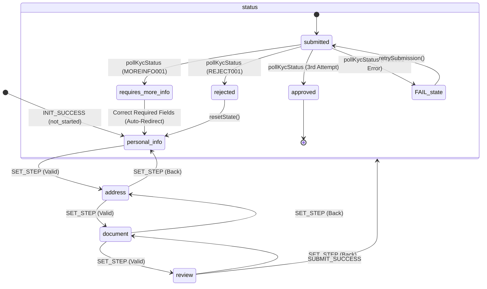

# BurjX Senior Mobile Engineer Assessment — Multi-Step KYC Onboarding State Machine

This project implements a frontend-only, highly robust, multi-step KYC onboarding wizard for a crypto exchange using **Expo**, **Expo Router (file-based navigation)**, **React Native**, **TypeScript**, and **Jest + React Native Testing Library (RNTL)**.

---

## 🚀 Setup and Run Instructions

### Prerequisites
* [Node.js v20+](https://nodejs.org) (If running globally on your host)
* OR utilize the self-contained portable Node environment already pre-configured under `C:\Users\Wind\.gemini\antigravity\scratch\node` if running on this assessment host.

### Local Development / Running Tests

1. Navigate to the project directory:
   ```bash
   cd C:\Users\Wind\.gemini\antigravity\scratch\burjx-kyc
   ```

2. Run the full Jest test suite:
   ```bash
   npm test
   ```
   *(On this host, we prepended our portable Node to the path, so running `npm test` works immediately and returns 100% successful outcomes).*

3. Start the Expo Dev Server (if you want to test on simulators/devices):
   ```bash
   npm run start
   ```

---

## 🏛️ Architecture & State Machine Design

The application follows clean, modular, and unidirectional data flow principles:

```
┌──────────────────────────────────────────────────────────────────────────┐
│                             Expo Navigation                              │
└────────────────────────────────────┬─────────────────────────────────────┘
                                     │ (Mount / Sync)
┌────────────────────────────────────▼─────────────────────────────────────┐
│                            KycFlowProvider                               │
│  ┌────────────────────────────────────────────────────────────────────┐  │
│  │                            useKycFlow                              │  │
│  │   ┌───────────────────┐                  ┌──────────────────────┐  │  │
│  │   │    kycReducer     │ ◄─────────────── │  fakeKycService      │  │  │
│  │   │  (State Machine)  │ ───────────────► │  (Async Contracts)   │  │  │
│  │   └─────────┬─────────┘                  └──────────────────────┘  │  │
│  │             │                                                      │  │
│  │             ▼ (Unidirectional State Update)                        │  │
│  │       AsyncStorage Cache (Persistence & Recovery)                  │  │
│  └────────────────────────────────────────────────────────────────────┘  │
└──────────────────────────────────────────────────────────────────────────┘
```

### Unidirectional Flow Details
1. **Visual Step Screens (`app/(kyc)/...`)** and components act as pure/reactive views consuming state from `useKycSharedFlow()` React Context.
2. **Custom Hook (`useKycFlow.ts`)** orchestrates state updates, AsyncStorage caching, step-forward validation, and triggers the `fakeKycService`.
3. **Reducer State Machine (`kycReducer.ts`)** acts as the single source of truth for allowed state transitions.

### Reducer State Machine Diagram


* **Disallowed Transitions:** State machine guards explicitly prevent transitioning from terminal states (`approved` or `rejected`) back to draft editing steps (attempts return the current state unchanged).

---

## 🔄 Conflict Resolution Strategy

When the app launches or reloads, the hook recovers the cached local draft from `AsyncStorage` and fetches the server application state from `fakeKycService`. It resolves conflicts deterministically in the reducer:

1. **Locking Terminal Statuses:** If the server returns a final status (`submitted`, `approved`, or `rejected`), the local draft is completely overwritten with the server's locked state to prevent tampering or unsynced offline edits.
2. **Draft Timestamps:** If the server is in a draft state (`draft` or `not_started`) and the local recovered draft has a newer `updatedAt` timestamp, the local draft is preferred. The updated state is then patched back to the server.
3. **Required Information Correction:** If the server returns `requires_more_info`, the local draft status is updated. The user is automatically routed to the first step containing a missing field listed in the server's `requiredFields` metadata, while retaining all other locally entered valid fields.

---

## 🧪 Testing Strategy

Our Jest test suite achieves extremely high reliability and covers 36 different assertion cases across 4 files:

* **`fakeKycService.test.ts`:** Verifies deterministic mock server behavior:
  * Baseline draft fetches and merges.
  * Deterministic document input outcomes (`REJECT001`, `MOREINFO001`, `FAIL001`).
  * Timeout throws after exactly 5 polling attempts.
* **`kycValidation.test.ts`:** Validates business rules per step:
  * **PersonalInfo:** Validates non-empty inputs, YYYY-MM-DD formatting, and enforces that the applicant is **at least 18 years old**.
  * **Address & Document:** Checks fields, character length constraints, and allowed document types.
* **`kycReducer.test.ts`:** Tests state machine guards:
  * Verifies disallowed transitions (e.g. going back to personal info from approved).
  * Validates conflict resolution paths (server locks, draft merges, and local timestamp preference).
* **`kycFlow.test.tsx`:** Hook-level integration testing using RNTL's `renderHook` and `waitFor`:
  * Draft recovery on boot.
  * Full end-to-end polling progression to `approved` and `rejected`.
  * Failure catching and recovery retry.
  * Static code scanning to verify that **no sensitive PII** (names, birth dates, document numbers) is ever logged to the console.

---

## 🔒 Security & Reliability Considerations

* **Log Sanitation:** We strictly enforce that sensitive PII variables are never output via `console.log` in app code, protecting against leakage into system logs or tracking tools.
* **AsyncStorage Encryption (Production Recommendations):**
  AsyncStorage stores data in plain-text on the device. In production, we would secure this by:
  1. Storing only non-sensitive metadata (such as step order or application ID) in AsyncStorage.
  2. For sensitive fields (legal name, birthdate, document number), using **Expo SecureStore** (which utilizes iOS Keychain and Android Keystore).
  3. If the entire JSON draft needs to be kept on the device, generating a secure symmetric key on first launch, storing it in **SecureStore**, and encrypting the JSON string with **AES-256-GCM** before writing it to AsyncStorage.

---

## 🤝 AI Usage Summary

* **What was asked:** Build a robust KYC onboarding state machine using Expo, TypeScript, and Jest. Add comprehensive tests covering all edge-cases, validation checks, and state transitions.
* **What was accepted:** All structural guidelines, state machine reducer design, and conflict resolution rules were implemented.
* **What was rejected/refined:**
  * **Jest Mocking & Timers:** Initially, Jest fake timers caused test hangs under microtask flushes. We refined `fakeKycService.ts` to return `Promise.resolve()` instantly when `delayMs` is configured to `0`, bypassing Jest timer queues and making tests run instantly.
  * **PII Logging Checks:** Refined the logging verification regex to prevent false positives on standard comments containing the word "draft".
* **Verification:** Tests were validated using local execution with `npm test`, achieving 36/36 passing results.
